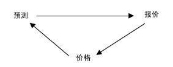

# 第 10 章 提纲挈领（The Documentary Hypothesis）

前提：

在一片文件的汪洋中，少数文档形成了关键的枢纽，每件项目管理的工作都围绕着它们运转。它们是经理们的主要个人工具。

The hypothesis:

Amid a wash of paper, a small number of documents become the critical pivots around which every project's management revolves. These are the manager's chief personal tools.

技术、周边组织机构、行业传统等若干因素凑在一起，定义了项目必须准备的一些文书工作。对于一个刚从技术人员中任命的项目经理来说，这简直是一件彻头彻尾令人生厌的事情，而且是毫无必要和令人分心的，充满了被吞没的威胁。但是，在实际工作中，大多数情况都是这样的。

慢慢的，他逐渐认识到这些文档的某些部分包含和表达了一些管理方面的工作。每份文档的准备工作是集中考虑，并使各种讨论意见明朗化的主要时刻。如果不这样，项目往往会处于无休止的混乱状态。文档的跟踪维护是项目监督和预警的机制。文档本身可以作为检查列表、状态控制，也可以作为汇报的数据基础。

为了阐明软件项目如何开展这项工作，我们首先借鉴一下其他行业一些有用的文档资料，看是否能进行归纳，得出结论。

## 计算机产品的文档

如果要制造一台机器，哪些是关键的文档呢？

目标：定义待满足的目标和需要，定义迫切需要的资源、约束和优先级。

技术说明：计算机手册和性能规格说明。它是在计划新产品时第一个产生，并且最后完成的文档。

进度、时间表

预算：预算不仅仅是约束。对管理人员来说，它还是最有用的文档之一。预算的存在会迫使技术决策的制订，否则，技术决策很容易被忽略。更重要的是，它促使和澄清了策略上的一些决定。

组织机构图

工作空间的分配

报价、预测、价格：这三个因素互相牵制，决定了项目的成败。

> 图 10.1

为了进行市场预测，首先需要制订产品性能说明和确定假设的价格。从市场预测得出的数值，连同从设计得出的组件单元的数量，决定了生产的估计成本，进而可以得到每个单元的开发工作量和固定的成本。固定成本又决定了价格。

如果价格低于假设值，令人欣慰的循环开始了。预测值较高，单元成本较低，因此价格能够继续降低。

如果价格高于预测值，灾难性的循环开始了，所有的人必须努力奋斗来打破这个循环。新应用程序必须提高性能和支持更高的市场预测。成本必须降低，以产出更低的报价。这个循环的压力常常是激励市场人员和工程师工作的最佳动力。

同时，它也会带来可笑的踌躇和摇摆。我记得曾经有一个项目，在三年的开发周期中，机器指令计数器的设计每六个月变化一次。在某个阶段，需要好一点的性能时，指令计数器采用触发器来实现；下一个阶段，成本降低是主要的焦点，指令计数器采用内存来实现。在另一个项目中，我所见过的最好的一个项目经理常常充当一个大型调速轮的角色，他的惯性降低了来自市场和管理人员的起伏波动。

## 大学科系的文档

除了目的和活动上的巨大差异，数量类似、内容相近的各类文档形成了大学系主任的主要资料集合。校长、教师会议或系主任的每一个决定几乎都是一个技术说明，或者是对这些文档的变更。

- 目标
- 课程描述
- 学位要求
- 研究报告（申请基金时，还要求计划）
- 课程表和课程的安排
- 预算
- 教室分配
- 教师和研究生助手的分配

注意这些文档的组成与计算机项目非常相似：目标、产品说明、时间安排、资金分配、空间分派和人员的划分。只有价格文档是不需要的，学校的决策机构完成了这项任务。这种相似性不是偶然的——任何管理任务的关注焦点都是时间、地点、人物、做什么、资金。

## 软件项目的文档

在许多软件项目中，开发人员从商讨结构的会议开始，然后开始书写代码。不论项目的规模如何小，项目经理聪明的做法都是：立刻正式生成若干文档作为自己的数据基础，哪怕这些迷你文档非常简单。接着，他会和其他管理人员一样要求各种文档。

做什么：目标。定义了待完成的目标、迫切需要的资源、约束和优先级。

做什么：产品技术说明。以建议书开始，以用户手册和内部文档结束。速度和空间说明是关键的部分。

时间：进度表

资金：预算

地点：工作空间分配

人员：组织图。它与接口说明是相互依存的，如同 Conway 的规律所述："设计系统的组织架构受到产品的约束限制，生产出的系统是这些组织机构沟通结构的映射。1"Conway 接着指出，一开始反映系统设计的组织架构图，肯定不会是正确的。如果系统设计能自由地变化，则项目组织架构必须为变化做准备。

## 为什么要有正式的文档？

首先，书面记录决策是必要的。只有记录下来，分歧才会明朗，矛盾才会突出。书写这项活动需要上百次的细小决定，正是由于它们的存在，人们才能从令人迷惑的现象中得到清晰、确定的策略。

第二，文档能够作为同其他人的沟通渠道。项目经理常常会不断发现，许多理应被普遍认同的策略，完全不为团队的一些成员所知。正因为项目经理的基本职责是使每个人都向着相同的方向前进，所以他的主要工作是沟通，而不是做出决定。这些文档能极大地减轻他的负担。

最后，项目经理的文档可以作为数据基础和检查列表。通过周期性的回顾，他能清楚项目所处的状态，以及哪些需要重点进行更改和调整。

我并不是很同意销售人员所吹捧的"完备信息管理系统"——管理人员只需在计算机上输入查询，显示屏上就会显示出结果。有许多基本原因决定了上述系统是行不通的。一个原因是只有一小部分管理人员的时间——可能只有 20%——用来从自己头脑外部获取信息。其他的工作是沟通：倾听、报告、讲授、规劝、讨论、鼓励。不过，对于基于数据的部分，少数关键的文档是至关重要的，它们可以满足绝大多数需要。

项目经理的任务是制订计划，并根据计划实现。但是只有书面计划是精确和可以沟通的。计划中包括了时间、地点、人物、做什么、资金。这些少量的关键文档封装了一些项目经理的工作。如果一开始就认识到它们的普遍性和重要性，那么就可以将文档作为工具友好地利用起来，而不会让它成为令人厌烦的繁重任务。通过遵循文档开展工作，项目经理能更清晰和快速地设定自己的方向。
