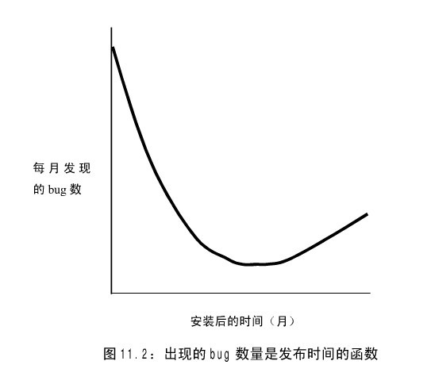

# 第 11 章 未雨绸缪（Plan to Throw One Away）

不变只是愿望，变化才是永恒。

——SWIFT

普遍的做法是，选择一种方法，试试看；如果失败了，没关系，再试试别的。不管怎么样，重要的是先去尝试。

——富兰克林 D. 罗斯福

There is nothing in this world constant but inconstancy.

——SWIFT

It is common sense to take a method and try it. If it fails, admit it frankly and try another. But above all, try something.

——FRANKLIN D. ROOSEVELT

## 试验性工厂和增大规模

化学工程师很早就认识到，在实验室可以进行的反应过程，并不能在工厂中一步实现。一个被称为"实验性工厂（pilot planet）"的中间步骤是非常必要的，它会为提高产量和在缺乏保护的环境下运作提供宝贵经验。例如，海水淡化的实验室过程会先在产量为 10,000 加仑/每天的试验场所测试，然后再用于 2,000,000 加仑/每天的净化系统。

软件系统的构建人员也面临类似的问题，但似乎并没有吸取教训。一个接一个的软件项目都是一开始设计算法，然后将算法应用到待发布的软件中，接着根据时间进度把第一次开发的产品发布给顾客。

对于大多数项目，第一个开发的系统并不合用。它可能太慢、太大，而且难以使用，或者三者兼而有之。要解决所有的问题，除了重新开始以外，没有其他的办法——即开发一个更灵巧或者更好的系统。系统的丢弃和重新设计可以一步完成，也可以一块块地实现。所有大型系统的经验都显示，这是必须完成的步骤。而且，新的系统概念或新技术会不断出现，所以开发的系统必须被抛弃，但即使是最优秀的项目经理，也不能无所不知地在最开始解决这些问题。

因此，管理上的问题不再是"是否构建一个试验性的系统，然后抛弃它？"你必须这样做。现在的问题是"是否预先计划抛弃原型的开发，或者是否将该原型发布给用户？"从这个角度看待问题，答案更加清晰。将原型发布给用户，可以获得时间，但是它的代价高昂——对于用户，使用极度痛苦；对于重新开发的人员，分散了精力；对于产品，影响了声誉，即使最好的再设计也难以挽回名声。

因此，为舍弃而计划，无论如何，你一定要这样做。

## 唯一不变的就是变化本身

一旦认识到试验性的系统必须被构建和丢弃，具有变更思想的重新设计不可避免，从而直面整个变化现象是非常有用的。第一步是接受这样的事实：变化是与生俱来的，不是不合时宜和令人生厌的异常情况。Cosgrove 很有洞察力地指出，开发人员交付的是用户满意程度，而不仅仅是实际的产品。用户的实际需要和用户感觉会随着程序的构建、测试和使用而变化。

当然对于硬件产品而言，同样需要满足要求，例如新型汽车或者计算机。但物体的客观存在容纳和阶段化（量子化）了用户对变更的要求。软件产品易于掌握的特性和不可见性，导致它的构建人员面临永恒的需求变更。

我从不建议顾客目标和需求的所有变更必须、能够、或者应该整合到设计中。项目开始时建立的基准，肯定会随着开发的进行越来越高，甚至开发不出任何产品。

然而，目标上的一些变化无可避免，事先为它们做准备总比假设它们不会出现要好得多。不但目标上的变化不可避免，而且设计策略和技术上的变化也不可避免。抛弃原型概念本身就是对事实的接受——随着学习的过程更改设计。

## 为变更计划系统

如何为上述变化设计系统，是个非常著名的问题，在书本上被普遍讨论——可能讨论得比实践还要多得多。它们包括细致的模块化、可扩展的函数、精确完整的模块间接口设计、完备的文档。另外，还可能会采用包括调用队列和表驱动的一些技术。

最重要的措施是使用高级语言和自文档技术，以减少变更引起的错误。采用编译时的操作来整合标准声明，在很大程度上帮助了变化的调整。

变更的阶段化是一种必要的技术。每个产品都应该有数字版本号，每个版本都应该有自己的日程表和冻结日期，在此之后的变更属于下一个版本的范畴。

## 为变更计划组织架构

Cosgrove 主张把所有计划、里程碑、日程安排都当作是尝试性的，以方便进行变化。这似乎有些走极端——现在软件编程小组失败的主要原因是管理控制得太少，而不是太多。

不过，他提出了一种卓越的见解。他观察到不愿意为设计书写文档的原因，不仅仅是由于惰性或者时间压力。相反，设计人员通常不愿意提交尝试性的设计决策，再为它们进行辩解。"通过设计文档化，设计人员将自己暴露在每个人的批评之下，他必须能够为他的每个结果进行辩护。如果团队架构因此受到任何形式的威胁，则没有任何东西会被文档化，除非架构是完全受到保护的。

为变更组建团队比为变更进行设计更加困难。每个人被分派的工作必须是多样的、富有拓展性的工作，从技术角度而言，整个团队可以灵活地安排。在大型的项目中，项目经理需要有两个和三个顶级程序员作为技术轻骑兵，当工作繁忙最密集的时候，他们能急驰飞奔，解决各种问题。

当系统发生变化时，管理结构也需要进行调整。这意味着，只要管理人员和技术人才的天赋允许，老板必须对他们的能力培养给予极大的关注，使管理人员和技术人才具有互换性。

这其中的障碍是社会性的，人们必须同顽固的戒心做斗争。首先，管理人员自己常常认为高级人员太"有价值"，而舍不得让他们从事实际的编程工作；其次，管理人员拥有更

高的威信。为了克服这个问题，如 Bell Labs 的一些实验室，废除了所有的职位头衔。每个专业人士都是"技术人员中的一员"。而 IBM 的另外一些实验室，保持了两条职位晋升线，如图 11.1 所示。相应的级别在概念上是相同的。

> 图 11.1：IBM 的两条职位晋升线

很容易为上述层次建立相互一致的薪水级别。但要建立一致的威信，会困难一些。比如，办公室的大小和布局应该相同。秘书和其他支持也必须相同。从技术线向管理同级调动时，不能伴随着待遇的提升，而且应该以"调动"，而不是"晋升"的名义。相反的调整则应该伴随着待遇的提高，对于传统意识进行补偿是必要的。

管理人员需要参与技术课程，高级技术人才需要进行管理培训。项目目标、进展、管理问题必须在高级人员整体中得到共享。

只要能力允许，高层人员必须时刻做好技术和情感上的准备，以管理团队或者亲自参与开发工作。这是件工作量很大的任务，但显然很值得！

组建外科手术队伍式的软件开发团队，这整个观念是对上述问题的彻底冲击。其结果是当高级人才编程和开发时，不会感到自降身份。这种方法试图清除那些会剥夺创造性乐趣的社会障碍。

另外，上述组织架构的设计是为了最小化成员间的接口。同样的，它使系统在最大程度上易于修改。当组织构架必须变化时，为整个"外科手术队伍"重新安排不同的软件开发任务，会变得相对容易一些。这的确是一个长期有效的灵活组织构架解决方案。

## 前进两步，后退一步

在程序发布给顾客使用之后，它不会停止变化。发布后的变更被称为"程序维护"，但是软件的维护过程不同于硬件维护。

计算机系统的硬件维护包括了三项活动——替换损坏的器件、清洁和润滑、修改设计上的缺陷。（大多数情况下——但不是全部——变更修复的是实现上、而不是结构上的一些缺陷。对于用户而言，这常常是不可见的。）

软件维护不包括清洁、润滑和对损坏器件的修复。它主要包含对设计缺陷的修复。和硬件维护相比，这些软件变更包含了更多的新增功能，它通常是用户能察觉的。

对于一个广泛使用的程序，其维护总成本通常是开发成本的 40％或更多。令人吃惊的是，该成本受用户数目的严重影响。用户越多，所发现的错误也越多。

麻省理工学院核科学实验室的 Betty Campbell 指出特定版本的软件发布生命期中一个有趣的循环。如图 11.2 所示。起初，上一个版本中被发现和修复的 bug，在新的版本中仍会出现。新版本中的新功能会产生新的 bug。解决了这些问题之后，程序会正常运行几个月。接着，错误率会重新攀升。Campbell 认为这是因为用户的使用到达了新的熟练水平，他们开始运用新的功能。这种高强度的考验查出了新功能中很多不易察觉的问题。

> 图 11.2：出现的 bug 数量是发布时间的函数

程序维护中的一个基本问题是——缺陷修复总会以（20－50）%的机率引入新的 bug。所以整个过程是前进两步，后退一步。

为什么缺陷不能更彻底地被修复？首先，看上去很轻微的错误，似乎仅仅是局部操作上的失败，实际上却是系统级别的问题，通常这不是很明显。修复局部问题的工作量很清晰，并且往往不大。但是，更大范围的修复工作常常会被忽视，除非软件结构很简单，或者文档书写得非常详细。其次，维护人员常常不是编写代码的开发人员，而是一些初级程序员或者新手。

作为引入新 bug 的一个后果，程序每条语句的维护需要的系统测试比其他编程要多。理论上，在每次修复之后，必须重新运行先前所有的测试用例，从而确保系统不会以更隐蔽的方式被破坏。实际情况中，回归测试必须接近上述理想状况，所以它的成本非常高。

显然，使用能消除、至少是能指明副作用的程序设计方法，会在维护成本上有很大的回报。同样，设计实现的人员越少、接口越少，产生的错误也就越少。

## 前进一步，后退一步

Lehman 和 Belady 研究了大型操作系统的一系列发布版本的历史。他们发现模块数量随版本号的增加呈线性增长，但是受到影响的模块以版本号指数的级别增长。所有修改都倾向于破坏系统的架构，增加了系统的混乱程度。用在修复原有设计上瑕疵的工作量越来越少，而早期维护活动本身的漏洞所引起修复工作越来越多。随着时间的推移，系统变得越来越无序，修复工作迟早会失去根基。每一步前进都伴随着一步后退。尽管理论上系统一直可用，但实际上，整个系统已经面目全非，无法再成为下一步进展的基础。而且，机器在变化，配置在变化，用户的需求在变化，所以现实系统不可能永远可用。崭新的、对于原有系统的重新设计是完全必要的。

通过对统计模型的研究，关于软件系统，Belady 和 Lehman 得到了更具普遍意义、为所有经验支持的结论。正如 Pascal. C. S. Lewis 所敏锐指出的：

这正是历史的关键。使用卓越的能源——构建文明——成立杰出的机构，但是每次总会出现问题。一些致命的缺陷会将自私和残酷的人带到塔尖，接着一切开始滑落，回到到痛苦和堕落。实际上，机器失灵了。看上去，就好像是机器正常启动，跑了几步，然后垮掉了。

系统软件开发是减少混乱度（减少熵）的过程，所以它本身是处于亚稳态的。软件维护是提高混乱度（增加熵）的过程，即使是最熟练的软件维护工作，也只是放缓了系统退化到非稳态的进程。
