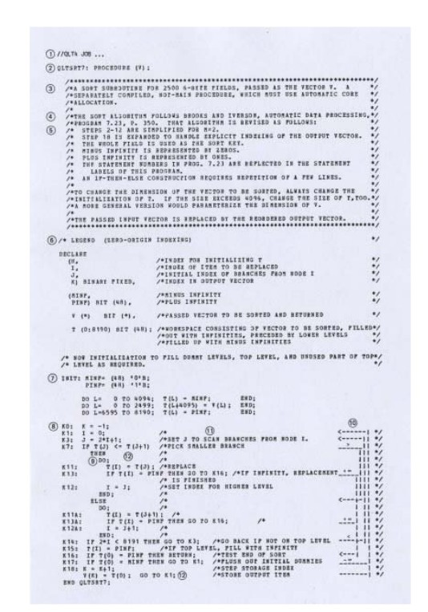

# 第 15 章 另外一面（The other face）

不了解，就无法真正拥有。

——歌德

噢，赐予我朴素的评论者吧，他们不会因过于深奥而让人困惑不解。

——克雷布

What we do not understand we do not possess.

——GOETHE

O give me commentators plain, Who with no deep researches vex the brain[jypan]

——CRABBE

计算机程序是从人传递到机器的一些信息。为了将人的意图清晰地传达给不会说话的机器，程序采用了严格的语法和严谨的定义。

但是书面的计算机程序还有其他的呈现面貌：向用户诉说自己的"故事"。即使是完全开发给自己使用的程序，这种沟通仍然是必要的。因为记忆衰退的规律会使用户——作者失去对程序的了解，于是他不得不重拾自己劳动的各个细节。

公共应用程序的用户在时间和空间上都远离它们的作者，因此对这类程序，文档的重要性更是不言而喻！对软件编程产品来说，程序向用户所呈现的面貌和提供给机器识别的内容同样重要。

面对那些文档"简约"的程序，我们中的大多数人都不免曾经暗骂那些远在他方的匿名作者。因此，一些人试图向新人慢慢地灌输文档的重要性：旨在延长软件的生命期、克服惰性和进度的压力。但是，很多次尝试都失败了，我想很可能是由于我们使用了错误的方法。

Thomas J. Watson 讲述了他年轻时在纽约北部，刚开始做收银机推销员的经历。他带着一马车的收银机，满怀热情地动身了。他工作得非常勤奋，但是连一台收银机也没有卖出去。他很沮丧地向经理汇报了情况，销售经理听了一会儿，说道："帮我抬一些机器到马车上，收紧缰绳，出发！"他们成功了。在接下来的客户拜访过程中，经理身体力行地演示了如何出售收银机。事实证明，这个方法是可行的。

我曾经非常勤奋地给我的软件工程师们举办了多年关于文档必要性以及优秀文档所应具备特点方面的讲座，向他们讲述——甚至是热诚地向他们劝诫以上的观点。不过，这些都行不通。我想他们知道如何正确地编写文档，却缺乏工作的热情。后来，我尝试了向马车上搬一些收银机，以此演示如何完成这项工作。结果显示，这种方法的效果要好得多。所以，文章剩余部分将对那些说教之辞一笔带过，而把重点放在"如何做（才能产生一篇优秀的文档）上。

## 需要什么样的文档

不同用户需要不同级别的文档。某些用户仅仅偶尔使用程序，有些用户必须依赖程序，还有一些用户必须根据环境和目的的变动对程序进行修改。

使用程序。每个用户都需要一段对程序进行描述的文字。可是大多数文档只提供了很少的总结性内容，无法达到用户要求，就像是描绘了树木，形容了树叶，但却没有一副森林的图案。为了得到一份有用的文字描述，就必须放慢脚步，稳妥地进行。

1. 目的。主要的功能是什么？开发程序的原因是什么？
2. 环境。程序运行在什么样的机器、硬件配置和操作系统上？
3. 范围。输入的有效范围是什么？允许显示的合法范围是什么？
4. 实现功能和使用的算法。精确地阐述它做了什么。
5. 输入－输出格式。必须是确切和完整的。
6. 操作指令。包括控制台及输出内容中正常和异常结束的行为。
7. 选项。用户的功能选项有哪些？如何在选项之间进行挑选？
8. 运行时间。在指定的配置下，解决特定规模问题所需要的时间？
9. 精度和校验。期望结果的精确程度？如何进行精度的检测？

一般来说，三、四页纸常常就可以容纳以上所有的信息。不过往往需要特别注意的是表达的简洁和精确。由于它包含了和软件相关的基本决策，所以这份文档的绝大部分需要在程序编制之前书写。

验证程序。除了程序的使用方法，还必须附带一些程序正确运行的证明，即测试用例。

每一份发布的程序拷贝应该包括一些可以例行运行的小测试用例，为用户提供信心——他拥有了一份可信赖的拷贝，并且正确地安装到了机器上。

然后，需要得到更加全面的测试用例，在程序修改之后，进行常规运行。这些用例可以根据输入数据的范围划分成三个部分。

1. 针对遇到的大多数常规数据和程序主要功能进行测试的用例。它们是测试用例的主要组成部分。
2. 数量相对较少的合法数据测试用例，对输入数据范围边界进行检查，确保最大可能值、最小可能值和其他有效特殊数据可以正常工作。
3. 数量相对较少的非法数据测试用例，在边界外检查数据范围边界，确保无效的输入能有正确的数据诊断提示。

修改程序。调整程序或者修复程序需要更多的信息。显然，这要求了解全部的细节，并且这些细节已经记录在注释良好的列表中。和一般用户一样，修改者迫切需要一份清晰明了的概述，不过这一次是关于系统的内部结构。那么这份概述的组成部分是什么呢？

1. 流程图或子系统的结构图，对此以下有更详细的论述。
2. 对所用算法的完整描述，或者是对文档中类似描述的引用。
3. 对所有文件规划的解释。
4. 数据流的概要描述——从磁盘或者磁带中，获取数据或程序处理的序列——以及在每个处理过程完成的操作。
5. 初始设计中，对已预见修改的讨论；特性、功能回调的位置以及出口；原作者对可能会扩充的地方以及可能处理方案的一些意见。另外，对隐藏缺陷的观察也同样很有价值。

## 流程图

流程图是被吹捧得最过分的一种程序文档。事实上，很多程序甚至不需要流程图，很少有程序需要一页纸以上的流程图。

流程图显示了程序的流程判断结构，它仅仅是程序结构的一个方面。当流程图绘制在一张图上时，它能非常优雅地显示程序的判断流向，但当它被分成几张时，也就是说需要采用经过编号的出口和连接符来进行拼装时，整体结构的概观就严重地被破坏了。

因此，一页纸的流程图，成为表达程序结构、阶段或步骤的一种非常基本的图示。同样，它也非常容易绘制。图 15.1 展示了一个子程序流程图的图样。

> 图 15.1：程序结构图（Courtesy of W. V. Wright）

当然，上述图纸既没有，也不需要遵循精心制订的 ANSI 流程图标准。所有图形元素如方框、连线、编号等，只需要能使这张详细的流程图可以理解就行了。

因此，逐一记录的详细流程图过时而且令人生厌，它只适合启蒙初学者的算法思维。

当 Goldstine 和 Neumann1 引入这种方法时，框图和框图中的内容作为一种高级别语言，将难以理解的机器语言组合成一连串可理解的步骤。如同早期 Iverson 所认识到的，在系统化的高级语言中，分组已经完成，每一个方框相应地包含了一条语句（图 15.2）。从而，方框本身变成了一件单调乏味的重复练习，可以去掉它们。这时，剩下的只有箭头。而连接相邻后续语句的箭头也是冗余的，可以擦掉它们。现在，留下的只有 GO TO 跳转。如果大家遵守良好的规则，使用块结构来消除 GO TO 语句，那么所有的箭头都消失了，尽管这些箭头能在很大程度上帮助理解。大家完全可以丢掉流程图，使用文字列表来表达这些内容。

现实中，流程图被鼓吹的程度远大于它们的实际作用。我从来没有看到过一个有经验的编程人员，在开始编写程序之前，会例行公事地绘制详尽的流程图。在一些要求流程图的组织中，流程图总是事后才补上。一些公司则很自豪地使用工具软件，从代码中生成这个"不可缺少的设计工具"。我认为这种普遍经验并不是令人尴尬和惋惜的对良好实践的偏离（似乎大家只能对它露出窘迫的微笑），相反，它是对技术的良好评判，向我们传授了一些流程图用途方面的知识。

耶稣门徒彼得谈到新的异教皈依者和犹太戒律时说道，"为什么让他们背负我们的祖先和我们自己都不能承担的重负呢？"（《使徒行传》 15:10 现代英文版本）。对于新的编程人员和陈旧的流程图方法，我持有相同的观点。

## 自文档化（self-documenting）的程序

数据处理的基本原理告诉我们，试图把信息放在不同的文件中，并努力维持它们之间的同步，是一种非常费力不讨好的事情。更合理的方法是：每个数据项包含两个文件都需要的所有信息，采用指定的键值来区别，并把它们组合到一个文件中。

不过，我们在程序文档编制的实践中却违反了我们自己的原则。典型的，我们试图维护一份机器可读的程序，以及一系列包含记叙性文字和流程图的文档。

结果和我们自己的认识相吻合。不同文件的数据保存带来了不良的后果。程序文档质量声名狼藉，文档的维护更是低劣：程序变动总是不能及时精确地反映在文档中。

我认为相应的解决方案是"合并文件"，即把文档整合到源代码。这对正确维护是直接有力的推动，保证编程用户能方便、即时地得到文档资料。这种程序被称为自文档化（self-documenting）。

![流程图和对应程序的对比[节选自 Thomas J. Cashman 和 Willian J. Keys（Harper & Row，1971）所著的"Data Processing and Computer Programming: A Modula Approach"中的图 15－41、15－44]](figures/fg15-2.jpg)
> 图 15.2：流程图和对应程序的对比[节选自 Thomas J. Cashman 和 Willian J. Keys（Harper & Row，1971）所著的"Data Processing and Computer Programming: A Modula Approach"中的图 15－41、15－44]

现在看来，在程序中包括流程图显然是一种笨拙（但不是不可以）的做法。考虑到流程图方法的落后和高级语言的使用占统治地位，把程序和文档放在一起显然是很合理的。

把源程序作为文档介质强制推行了一些约束。另一方面，对于文档读者而言，一行一行的源程序本身就可以再次利用，使新技术的使用成为可能。现在，已经到了为程序文档设计一套彻底的新方法的时候了。

文档是我们以及前人都不曾成功背负的重担。作为基本目标，我们必须试图把它的负担降到最小。

方法。第一个想法是借助那些出于语言的要求而必须存在的语句，来附加尽可能多的"文档"信息。因此，标签、声明语句、符号名称均可以作为工具，用来向读者表达尽可能多的意思。

第二个方法是尽可能地使用空格和一致的格式提高程序的可读性，表现从属和嵌套关系。

第三，以段落注释的形式，向程序中插入必要的记叙性文字。大多数文档一般都包括足够多的逐行注释，特别是那些满足公司呆板的"良好文档"规范的程序，通常就包含了很多注释。即使是这些程序，在段落注释方面也常常是不够的，而段落注释能提供总体把握和真正加深读者对整件事情的理解。

因为文档是通过程序结构、命名和格式来实现的，所有这些必须在书写代码时完成。不过，这也只是应该完成的时间。另外，由于自文档化的方法减少了很多附加工作，使这件工作遇到的障碍会更少。

一些技巧。图 15.3 是一段自文档化的 PL/I 程序。圆圈中的数字不是程序的组成部分，而是用来帮助我们进行讨论。

> 图 15.3：一段子文档化程序

1. 为每次运算使用单独的任务名称。维护一份日志，记录程序运行的目的、时间和结果。如果名称由一个助记符（这里是 QLT）和数字后缀（4）组成，那么后缀可以作为运算编号，把列表和日志联系在一起。这种技术要求为每次运算准备新的任务卡，不过这项工作可以采用"重复进行公共信息的批处理"来完成。
2. 使用包含版本号和能帮助记忆的程序名称。即，假设程序将会有很多版本。例子中使用的是 1967 年的最低一位数字。
3. 在过程（PROCEDURE）的注释中，包含记叙性的描述文字。
4. 尽可能为基本算法提供参考引用，通常它会指向更完备的处理方法。这样，既节省了空间，同时还允许那些有经验的读者能非常自信地略过这一段内容。
5. 显示和算法书籍中的传统算法的关系。
   a) 更改 b) 定制细化 c) 重新表达
6. 声明所有的变量。采用助记符，并使用注释把 DECLARE 转化成完整的说明。注意，声明已经包含了名称和结构性描述，需要增加的仅仅是对目的的解释。通过这种方式，可以避免在不同的处理中重复名称和结构性的描述。
7. 用标签标记出初始化的位置。
8. 对程序语句进行分组和标记，以显示与设计文档中语句单元的一致性。
9. 利用缩进表现结构和分组。
10. 在程序列表中，手工添加逻辑箭头。它们对调试和变更非常有帮助。它们还可以补充在页面右边的空白处（注释区域），成为机器可读文字的一部分。
11. 使用行注释来解释任何不很清楚的事情。如果采用了上述技术，那么注释的长度和数量都将小于传统惯例。
12. 把多条语句放置在一行，或者把一条语句拆放在若干行，以吻合逻辑思维，表示和其他算法描述一致。

为什么不？这种方法的缺点在什么地方？很多曾经遇到的困难，已经随着技术的进步逐渐解决了。

最强烈的反对来自必须存储的源代码规模的增加。随着编程技术越来越向在线源代码存储的方向发展，这成为了一个主要的考虑因素。我发现自己编写的 APL 程序注释比 PL/I 程序要少，这是因为 APL 程序保存在磁盘上，而 PL/I 则以卡片的形式存储。

然而，与此同时文本编辑的访问和修改，也在朝在线存储的方向前进。就像前面讨论过的，程序和文字的混合使用减少了需要存储的字符总数。

对于文档化程序需要更多输入击键的争论，也有类似的答案。采用打字方式，每份草稿、每个字符需要至少一次击键。而自文档化程序的字符总数更少，每个字符需要的击键次数也更少，并且电子草稿不需要重复打印。

那么流程图和结构图的情况又如何呢？如果仅仅使用最高级别的结构图，那么另外使用一份文档的方法可能更安全一些，因为结构通常不会频繁变化。它理所当然也可以作为注释合并到文档中。这显然是一种聪明的作法。

以上讨论的用于文档和软件汇编的方法到底有多大的应用范围呢？我认为"自文档化"方法的基本思想可以得到大规模的应用。""自文档化"方法"对空间和格式要求更为严格，这一点的应用可能会受限；而命名和结构化声明显然可以利用起来，在这方面，宏可以起到很大的帮助；另外，段落注释的广泛使用在任何语言中都是一个很棒的实践。

自文档化方法激发了高级语言的使用，特别是用于在线系统的高级语言——无论是对批处理还是交互式，它都表现出最强的功效和应用的理由。如同我曾经提到的，上述语言和系统强有力地帮助了编程人员。因为是机器为人服务，而不是人为机器服务。因此从各个方面而言，无论是从经济上还是从以人为本的角度来说，它们的应用都是非常合情合理的。
