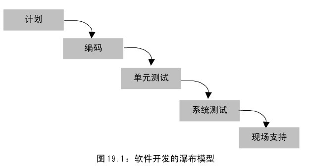
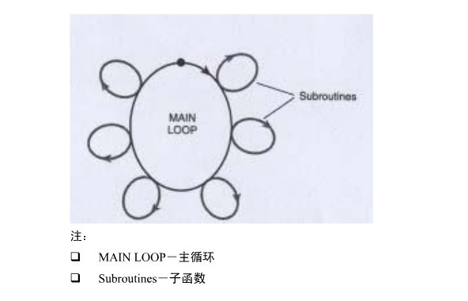
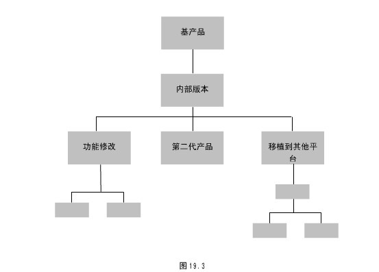

# 第 19 章 20 年后的人月神话（The Mythical Man-Month after 20 Years）

只能根据过去判断将来。

——帕特里克·亨利

然而永远无法根据过去规划将来。

——埃德蒙·伯克

I know no way of judging the future but by the past.

——PATRICK HENRY

You can never plan the future by the past.

——EDMUND BURKE

## 为什么会出现二十周年纪念版本？

飞机划破夜空，嗡嗡地飞向纽约的拉瓜迪亚机场。所有的景色都隐藏在云层和黑暗之中。我正在看一篇平淡无奇的文档，不过并没有感到厌烦。紧挨着我的一位陌生人正在阅读《人月神话》，我在旁边一直等待着，看他是否会通过文字或者手势做出反映。最后，当我们向舱门移动时，我无法再等下去了：

"这本书如何？你有什么评论吗？"

"噢！这里面的东西我早就知道。"

此刻，我决定不介绍自己。

为什么《人月神话》得以持续？为什么看上去它仍然和现在的软件实践相关？为什么它还拥有软件工程领域以外的读者群，律师、医生、社会学家、心理学家，和软件人员一样，不断地对这本书提出评论意见，引用它，并和我保持通信？20 年前的一本关于 30 年前软件开发经验的书，如何能够依然和现实情况相关？更不用说有所帮助了。

常听到的一个解释是软件开发学科没有正确地发展，人们经常通过比较计算机软件开发生产率和硬件制造生产率来支持这个观点，后者在 20 年内至少翻了 1000 倍。正像第 16 章所解释的，反常的并不是软件发展得太慢，而是计算机硬件技术以一种与人类历史不相配的方式爆发出来。大体上这源于计算机制造从装配工业向流水线工业、从劳动密集型向资金密集型的逐渐过渡。与生产制造相比，硬件和软件开发保持着固有的劳动密集型特性。

第二个经常提及的解释——《人月神话》仅仅是顺便提及了软件，而主要针对团队中的成员如何创建事物。这种说法的确有些道理，1975 年版本的前言中提到，软件项目管理并不像大多数程序员起初所认为的那样，而更加类似于其他类型的管理。现在，我依然认为这是正确的。人类历史是一个舞台，总是上演着相同的故事。随着文化的发展，这些故事的剧本变化非常缓慢，而舞台的布局却在随时改变。正是如此，我们发现二十世纪本身会反映在莎士比亚、荷马的作品和圣经中。因此，某种程度上，《人月神话》是关于人与团队的书，所以它的淘汰过程会是缓慢的。

不管出于什么原因，读者仍然在购买这本书，并且常给我发一些致谢的评论。现在，我常常被问到："你现在认为哪些在当时就是错误的？哪些是现在才过时的？哪些是软件工程领域中新近出现的？"这些独特的问题是完全平等的，我将尽我最大的能力来回答它们。不过，不以上述顺序，而是按照一系列主题来答复。首先，让我们考虑那些在写作时就正确，现在依然成立的部分。

## 核心观点：概念完整性和结构师

概念完整性。一个整洁、优雅的编程产品必须向它的每个用户提供一个条理分明的概念模型，这个模型描述了应用、实现应用的方法以及用来指明操作和各种参数的用户界面使用策略，。用户所感受到的产品概念完整性是易用性中最重要的因素。（当然还有其他因素。Macintosh 上所有应用程序界面的统一就是一个重要的例子。此外，有可能建立统一的接口，尽管它可能很粗糙，就像 MS-DOS。）

有很多由一个或者两个人设计的优秀软件产品例子。大多数纯智力作品，像书籍、音乐等都是采用这种方式创作出来的。不过，很多产业的产品开发过程无法负担这种获取概念完整性的直接方法。竞争带来了压力，很多现代工艺的最终产品是非常复杂的，它们的设计需要很多人月的工作量。软件产品十分复杂，在进度上的竞争也异常激烈。

任何规模很大或者非常紧急，并需要很多人力的项目，都会碰到一个特别的困难：必须由很多人来设计，但与此同时，还需要在概念上保持与单个使用人员的一致。如何组织设计队伍来获得上述的概念一致性？这是《人月神话》关注的主要问题。其中一点：由于参与人数的不同，大型编程项目的管理与小型项目在性质上都不同。为了获得一致性，经过深思熟虑的，有时甚至是英勇的管理活动是完全必要的。

结构师。从第 4 到第 7 章，我一直不断地在表达一个观点——委派一名产品结构师是最重要的行动。结构师负责产品所有方面的概念完整性，这些是用户能实际感受到的。结构师开发用于向用户解释使用的产品概念模型，概念模型包括所有功能的详细说明以及调用和控制的方法。结构师是这些模型的所有者，同时也是用户的代理。在不可避免地对功能、性能、规模、成本和进度进行平衡时，卓有成效地体现用户的利益。这个角色是全职工作，只有在最小的团队中，才能和团队经理的角色合并。结构师就像电影的导演，而经理类似于制片人。

将体系结构和设计实现、物理实现相分离。为了使结构师的关键任务更加可行，有必要将用户所感知的产品定义——体系结构，与它的实现相分离。体系结构和实现的划分在各个设计任务中形成了清晰的边界，边界两边都有大量的工作。

体系结构的递归。对于大型系统，即使所有实现方面的内容都被分离出去，一个人也无法完成所有的体系结构工作。所以，有必要由一位主结构师把系统分解成子系统，系统边界应该划分在使子系统间接口最小化和最容易严格定义的地方。每个部分拥有自己的结构师，他必须就体系结构向主结构师汇报。显然，这个过程可以根据需要重复递归地进行。

今天，我比以往更加确信。概念完整性是产品质量的核心。拥有一位结构师是迈向概念完整性的最重要一步。这个原理决不仅限于软件系统，它适用于所有的复杂事物，如计算机、飞机、防御系统、全球定位系统等。在软件工程试验室进行 20 次以上的讲授之后，我开始坚持每 4 个学生左右的小组就选择不同的经理和结构师。在如此小的队伍中定义截然不同的角色可能是有点极端，但我仍然发现这种方法即使对小型团队也运作良好，并且促使了设计的成功。

## 开发第二个系统所引起的后果：盲目的功能和频率猜测

为大型用户群设计。个人计算机革命的一个结果是，至少在商业数据处理领域中，客户应用程序越来越多地被商用软件包所代替。而且，标准软件包以成百上千，甚至是数百万拷贝的规模出售。源厂商支持性软件的系统结构师必须不断地为大型的不确定用户群，而不是为某个公司的单一、可定义的应用进行设计。许许多多的系统结构师现在面临着这项任务。

但自相矛盾的是，设计通用工具比设计专用工具更加困难，这是因为必须为不同用户的各种需要分配权重。

盲目的功能（Featuritis）。对于如电子表格或字处理等通用工具的结构师，一个不断困扰他们的诱惑是以性能甚至是可用性的代价，过多地向产品添加边界实用功能。

功能建议的吸引力在初期阶段是很明显的，性能代价在系统测试时才会出现。而随着功能一点一点地添加，手册慢慢地增厚，易用性损失以不易察觉的方式蔓延。1

对幸存和发展了若干代的大众软件产品，这种诱惑特别强烈。数百万的用户需要成百上千的功能特色，任何需求本身就是一种"市场需要它"的证明。而常见的情况是，原有的系统结构师得到了嘉奖，正工作在其他岗位或项目上，现在负责体系结构的结构师，在均衡表达用户的整体利益方面，往往缺乏经验。一个对 Microsoft Word 6.0 的近期评价声称"Word 6.0 对功能特性进行了打包，通过包缓慢地更新..Word 6.0 同样是大型和慢速的。"有点令人沮丧的是——Word 6.0 需要 4MB 内存，丰富的新增功能意味着"甚至 Macintosh IIfx 都不能胜任 Word 6 的任务"2。

定义用户群。用户群越大和越不确定，就越有必要明确地定义用户群，以获得概念完整性。设计队伍中的每个成员对用户都有一幅假想的图像，并且每个设计者的图像都是不同的。结构师的用户图像会有意或者无意地影响每个结构决策，因此有必要使设计队伍共享一幅相同的用户图像。这需要把用户群的属性记录下来，包括：

- 他们是谁
- 他们需要（need）什么
- 他们认为自己需要（need）什么
- 他们想要（want）的是什么

频率。对于软件产品，任何用户群属性实际上都是一种概率分布，每个属性具有若干可能的值，每个值有自己的发生频率。结构师如何成功地得到这些发生频率？对并未清晰定义的对象进行调查是一种不确定和成本高昂的做法 3。经过很多年，我现在确信，为了得到完整、明确和共有的用户群描述，结构师应该猜测（guess），或者假设（postulate）完整的一系列属性和频率值。

这种不是很可靠的过程有很多好处。首先，仔细猜测频率的过程会使结构师非常细致地考虑对象用户群。其次，把它们写下来一般会引发讨论，这能起到解释的作用，以及澄清不同设计人员对用户图像认识上的差异。另外，明确地列举频率能帮助大家认识到哪些决策依赖于哪些用户群属性。这种非正式的敏感性分析也是颇有价值的。当某些非常重要的决策需要取决于一些特殊的猜测时，很值得为那些数值花费精力来取得更好的估计。（Jeff Conklin 开发的 gIBIS 提供了一种工具，能精确和正式地跟踪设计决策和文档化每个决策的原因 4。我还没有机会使用它，但是我认为它应该非常有帮助。）

总结：为用户群的属性明确地记载各种猜测。清晰和错误都比模糊不清好得多。

"开发第二系统所引起的后果（second-system effect）"情况怎样？一位敏锐的学生说，人月神话推荐了一剂对付灾难的处方：计划发布任何新系统的第二个版本（第 11 章），第二系统在第 5 章中被认为是最危险的系统。

这实际上是语言引起的的差异，现实情况并不是如此。第 5 章中提到的"第二个"系统是第二个实际系统，它是引入了很多新增功能和修饰的后续系统。第 11 章中的"第二个"系统指开发第一个实际系统所进行的第二次尝试。它在所有的进度、人员和范围约束下开发，这些约束刻画了项目的特征，形成了开发准则的一部分。

## 图形（WIMP）界面的成功

在过去 20 年内，软件开发领域中，令人印象最深刻的进步是窗口（Windows）、图标（Icons）、菜单（Menus）、指针选取（Pointing）界面的成功——或者简称为 WIMP。这些在今天是如此的熟悉，以致于不需要任何解释。这个概念首先在 1968 年西部联合计算机大会（Western Joint Computer Converence）上，由斯坦福研究机构（Stanford Research Institute）的 Doug Englebart 公开提出 5。接着，这种思想被 Xerox Palo Alto Research Center 所采纳，用在了由 Bob Taylor 和他的团队所开发的 Alto 个人工作站中。Steve Jobs

在 Apple Lisa 型计算机中应用了该理念，不过 Apple Lisa 运行速度太慢，以致于无法承载这个令人激动的易用性概念。后来在 1985 年，Jobs 在取得商业成功的 Apple Macintosh 机器上体现了这些想法。接下来，它们被 IBM PC 及其兼容机的 Microsoft Windows 所采用。我自己的例子则是 Mac 版本 6。

通过类比获得的概念完整性。WIMP 是一个充分体现了概念完整性的用户界面例子，完整性的获得是通过采用大家非常熟悉的概念模型——对桌面的比喻，以及一致、细致的扩展，后者充分发挥了计算机的图形化实现能力。例如，窗口采用覆盖，而不是排列的方式，这直接来自类比。尽管这种方法成本很高，但却是正确的决定。计算机图形介质提供了对窗口尺寸的调整，这是一种保持一致概念的延伸，给用户提供了新的处理能力，桌面上的文件是无法轻易地调整大小和改变形状的；拖放功能则直接出自模仿，使用指针来选择图标是对人用手拾起东西的直接模拟；图标和嵌套文件夹源于桌面的文档，回收站也是如此；剪切、复制和粘贴则完全反映了我们使用文档的一些习惯；我们甚至可以通过向回收站拖拽磁盘的图标来弹出磁盘——象征手法是如此的贴切，扩展是如此的连贯一致，以致于新用户常常会被它所体现出的理念打动。

哪些地方使 WIMP 界面远远超越了桌面的比喻？主要是在两个方面：菜单和单手操作。

在真正的桌面上工作时，人们实际上是操作文档，而不是叫某人来完成这些动作。当要求他人进行某个活动时，常常是新产生，而不是选择一个口头或者书面祈使句："请将这个归档。"

"请找出前面一致的地方。""请把这个交给 Mary 去处理。"

无论是手写还是口头的命令，现有处理能力还无法对自由产生的命令形式进行可靠的翻译和解释。所以，界面设计人员从用户对文档的直接动作中去除了上面提到的两个步骤。他们非常聪明地从桌面文档操作中选取了一些常用命令，形成了类似于公文的"便条"，用户只需从一些语义标准的强制命令菜单中进行选择。这个概念接着被延伸到水平菜单和垂直的下拉子菜单中。

命令表达和双光标问题。命令是祈使句，它们通常都有一个动词和直接宾语。对于任何动作，必须指定一个动词和一个名词。对事物选取的直接模仿要求：使用屏幕上不同的两个光标，同时指定两件事物。每个光标分别由左右手中的鼠标来控制。毕竟，在实际的桌面上，我们通常使用两只手来操作。（不过，一只手常常是将东西固定在某处，这一点在计算机桌面是默认情况。）而且，我们当然具备双手操作的能力，我们习惯上使用双手来打字、

驾驶、烹饪。但是，提供一个鼠标已经是个人计算机制造商向前迈进的一大步，没有任何商业系统可以容纳由双手分别控制的两只鼠标同时进行的动作 7。

界面设计人员接受了现实，为一只鼠标设计。设计人员采用的句法习惯是首先指出（选择）名词的，接着指出一个动词菜单项。这确实牺牲了很多易用性。当我看到用户、或者用户录像、或者光标移动的计算机跟踪情况。我立刻对一个光标必须完成两件事而感到惊讶：选择窗口上桌面部分的一个对象，再选择菜单部分的一个动词，寻找或者重新寻找桌面上的一个对象。接着，拉下菜单（常常是同一个）选择一个动词。光标来来往往、周而复始地从数据区移到菜单区，每一次都丢弃了一些有用的位置信息"上次在这个空间的什么地方"——总而言之，是一个低效的过程。

一个卓越的解决方案。即使软件和器材可以很容易实现两个同时活动的光标，也仍然存在一些空间布局上的困难。WIMP 象征手法中的桌面实际上包括了一个打字机，它必须在实际桌面的物理空间中容纳一个物理键盘。键盘加上两个鼠标垫会占据大量双手所及的空间。不过，键盘问题实际上是一个机会——为什么不一只手在键盘上指定动词，另一只手使用鼠标来指定名词，从而使高效的双手操作成为可能？这时，光标停留在数据区，为后续点击拾取提供了充分的空间活动能力。真正的高效，真正强大的用户功能。

用户功能和易用性。不过，这个解决方案舍弃了一些易用性——菜单提供了任何特定状态下的一些可选的有效动词。例如，我们可以购买某个商品，将它带回家，紧记购买的目的，遵照菜单上不同的动词略为试验一下，就可以开始使用，并不需要去查看手册。

软件结构师所面临的最困难问题是如何确切地平衡用户功能和易用性。是为初学者或偶尔使用的用户设计简单操作，还是为专业用户设计强大的功能？理想的答案是通过概念一致的方式把两者都提供给用户——这正是 WIMP 界面所达到的目标。每个频繁使用的菜单动词（命令）都有一个快捷键，因此可以作为组合通过左手一次性地输入。例如，在 Mac 机器上，命令键（♂[jypan2]）正好在 Z 和 X 键的下方，因此使用最频繁的操作被编码成 ♂z、♂x、♂c、♂v、♂s。

从新手向熟练用户的逐渐过渡。双重指定命令动词的系统不但满足了新手快速学习的需要，而且它在不同的使用模式之间提供了平滑的过渡。被称为快捷键的字符编码，显示在菜单上的动词旁边，因此拿不准的用户可以激活下拉菜单，检查对应的快捷键，而不是直接在菜单上选取。每个新手从他最常使用的命令中学习快捷键。由于 ♂z 可以撤消任何单一操

作，所以他可以尝试任何感到不确定的快捷键。另外，他可以检查菜单，以确定命令是否有效。新手会大量地使用菜单，而熟练用户几乎不使用，中间用户仅偶尔需要访问菜单，因为每个人都了解组成自己大多数操作的少数快捷键。我们大多数的开发设计人员对这样的界面非常熟悉，对其优雅而强大的功能感到非常欣慰。

强制体系结构的实施，作为设备的直接整合。Mac 界面在另一个方面很值得注意。没有任何强迫，它的设计人员在所有的应用程序中使用标准界面，包括了大量的第三方程序。从而，用户在界面上获得的概念一致性不仅仅局限在机器所配备的软件，而且遍及所有的应用程序。

Mac 设计人员把界面固化到只读内存中，从而开发者使用这些界面比开发自己的特殊界面更容易和快速。这些获取一致性的措施得到了足够广泛的应用，以致于可以形成实际的标准。Apple 的管理投入和大量说服工作协助了这些措施。产品杂志中很多独立评论家，认识到了跨应用概念完整性的巨大价值，通过批评不遵从产品的反面例子，对上述方法进行了补充。

这是第 6 章中所推荐技术的一个非常杰出的例子，该技术通过鼓励其他人直接将某人的代码合并到自己的产品中来获得一致性，而不是试图根据某人的技术说明开发自己的软件。

WIMP 的命运：过时被淘汰。尽管 WIMP 有很多优点，我仍期望 WIMP 界面在下一代技术中成为历史。如同我们支配我们机器一样，指针选取仍将是表达名词的方式，语音则无疑成为表达动词的方法。Mac 上的 Voice Navigator 和 PC 上的 Dragon 已经提供了这种能力。

## 没有构建舍弃原型——瀑布模型是错误的！

一幅让人无法忘怀的图画，倒塌的塔科马大桥，开启了第 11 章。文中强烈地建议："为舍弃而计划。无论如何，你一定要这样做。"现在我觉得这是错误的，并不是因为它太过极端，而是因为它太过简单。

在《未雨绸缪》一章体现的概念中，最大的错误是它隐含地假设了使用传统的顺序或者瀑布开发模型。该模型源自于类似甘特图布局的阶段化流程，常常绘制成图 19.1 的形状。Winton Royce 在 1970 年的一篇经典论文中，改进了顺序模型，他提出：

- 存在一些从一个阶段到前一个阶段的反馈
- 将反馈限定在直接相邻的先前阶段，从而容纳它引起的成本增加和进度延迟

> 图 19.1：软件开发的瀑布模型

他给开发者提出的建议"构建两次"比《人月神话》的好 8。受到瀑布模型不良影响并不只是第 11 章，而是从第 2 章的进度计划规则开始，贯穿了整本书。第 2 章中的经验法则分配了 1/3 的时间用于计划，1/6 用于编码，1/4 用于单元测试以及 1/4 用于系统测试。

瀑布模型的基本谬误是它假设项目只经历一次过程，而且体系结构出色并易于使用，设计是合理可靠的，随着测试的进行，编码实现是可以修改和调整的。换句话说，瀑布模型假设所有错误发生在编码实现阶段，因此它们的修复可以很顺畅地穿插在单元和系统测试中。

实际上，《未雨绸缪》并没有迎面痛击这个错误。它不是对错误的诊断，而是补救措施。现在，我建议应该一块块地丢弃和重新设计系统，而不是一次性地完成替换。就目前的情况而论，这没有问题，但它并没有触及问题的根本。瀑布模型把系统测试，以及潜在地把用户测试放在构件过程的末尾。因此，只有在投入了全部开发投资之后，才能发现无法接受的性能问题、笨拙功能以及察觉用户的错误或不当企图。不错，Alpha 测试对规格说明的详细检查是为了尽早地发现这些缺陷，但是对于实际参与的用户却没有对应的措施。

瀑布模型的第二个谬误是它假设整个系统一次性地被构建，在所有的设计、大部分编码、部分单元测试完成之后，才为闭环的系统测试合并各个部分。

瀑布模型，这个大多数人在 1975 年考虑的软件项目开发方法，不幸地被奉为军用标准 DOD-STD-2167，作为所有国防部军用软件的规范。所以，在大多数有见地的从业者认识到瀑布模型的不完备并放弃之后，它仍然得以幸存。幸运的是，DoD 也已经慢慢察觉到这一点 9。

必须存在逆向移动。就像本章开始图片中精力充沛的大马哈鱼一样，在开发过程"下游"的经验和想法必须跃行而上，有时会超过一个阶段，来影响"上游"的活动。

例如，设计实现会发觉有些体系结构的功能定义会削弱性能，从而体系结构必须重新调整。编码实现会发现一些功能会使空间剧增，超过要求，因此必须更改体系结构定义和设计实现。

所以，在把任何东西实现成代码之前，可能要往复迭代两个或更多的体系结构－设计

－实现循环。

## 增量开发模型更佳——渐进地精化

构建闭环的框架系统

从事实时系统开发的 Harlan Mills，早期曾提倡我们首先应该构建实时系统的基本轮询回路，为每个功能都提供子函数调用（占位符），但仅仅是空的子函数（图 19.2）。对它进行编译、测试，使它可以不断运行。它不直接完成任何事情，但至少是正常运行的 10。

注：

.. MAIN LOOP－主循环

.. Subroutines－子函数

> 图 19.2

接着，我们添加（可能是基本的）输入模块和输出模块。瞧，一个可运行的系统出现了，尽管只是一个框架。然后，一个功能接一个功能，我们逐渐开发和增加相应模块。在每个阶段，我们都拥有一个可运行的系统。如果我们非常勤勉，那么每个阶段都会有一个经过调试和测试的系统。（随着系统的增长，使用所有先前的测试用例对每个新模块进行的回归测试也采用这种方式进行。）

在每个功能基本可以运行之后，我们一个接一个地精化或者重写每个模块——增量地开发（growing）整个系统。不过，我们有时的确需要修改原有的驱动回路，或者甚至是回路的模块接口。

因为我们在所有时刻都拥有一个可运行的系统，所以

- 我们可以很早开始用户测试，以及
- 我们可以采用按预算开发的策略，来彻底保证不会出现进度或者预算的超支（以允许的功能牺牲作为代价）。

我曾在北卡罗来纳大学教授软件工程实验课程 22 年，有时与 David Parnas 一起。在这门课程中，通常 4 名学生的团队会在一个学期内开发某个真正的实时软件应用系统。大约是一半的时候，我转而教授增量开发的课程。我常常会被屏幕上第一幅图案、第一个可运行的系统对团队士气产生的鼓舞效果而感到震惊。

Parnas 产品族

在这整个 20 年的时间里，David Parnas 曾是软件工程思潮的带头人。每个人对他的信息隐藏概念都很熟悉，但对他另一个非常重要的概念——将软件作为一系列相关的产品族来设计 11——相对了解较少。Parnas 力劝设计人员对产品的后期扩展和后续版本进行预测，定义它们在功能或者平台上的差异，从而搭建一棵相关产品的家族树（图 19.3）。

设计类似一棵树的技巧是将那些变化可能性较小的设计决策放置在树的根部。

这样的设计使得模块的重用最大化。更重要的是，可以延伸相同的策略，使它不但可以包括发布产品，而且还包括以增量开发策略创建的后续中间版本。这样，产品可以通过它的中间阶段，以最低限度的回溯代价增长。

> 图 19.3

Microsoft 的"每晚重建"方法

Jams McCarthy 向我描述了他的队伍和微软其他团队所使用的产品开发流程，这实际上是一种逻辑上的增量式开发。他说，

在我们第一次产品发布之后，我们会继续发布后续版本，向已有的可运行系统添加更多的功能。为什么最初的构建过程要不一样呢？因此，从我们第一个里程碑开始[第一次发布有三个里程碑]，我们每晚重建开发中的系统[以及运行测试用例]。该构建周期成了项目的"心跳"。每天，一个和多个程序员-测试员队伍提交若干具有新功能的模块。在每次重建之后，我们会获得一个可运行的系统。如果重建失败，我们将停下整个过程，直到找到问题所在并进行修复。在任何时间，团队中的每个人都了解项目的状态。

这是非常困难的。你必须投入大量的资源，而且它是一个规范化、可跟踪、开诚布公的流程。它向团队提供了自身的可信度，而可信度决定了你的士气和情绪状态。

其他组织的软件开发人员对这个过程感到惊讶，甚至震惊。其中一个人说："我们可以实现每周一次的重建，但是如果每晚一次的话，我想不大可能，工作量太大了。"这可能是对的。例如，Bell 北方研究所就是每周重建 1 千 2 百万行的系统。

文本框: 功能修改

文本框: 移植到其他平台

文本框: 第二代产品

文本框: 内部版本

文本框: 基产品

增量式开发和快速原型

增量开发过程能使真正的用户较早地参与测试，那么它与快速原型之间的区别是什么呢？我认为它们既是互相关联，又是相互独立的。各自可以不依赖对方而存在。

Harel 将原型精彩地定义成：

仅仅反映了概念模型准备过程中所做的设计决策[的一个程序版本]，它并未反映受实现考虑所驱使的设计决策 12。

构建一个完全不属于发布产品的原型是完全可能的。例如，可以开发一个界面原型，但是并不包含任何的实际功能，而仅仅是一个看上去履行了各个步骤的有限状态机。甚至可以通过模拟系统响应的向导技术来原型化和测试界面。这种原型化对获取早期的用户反馈非常有用，但是它和产品发布前的测试区别很大。

类似的，实现人员可能会着手开发产品的某一块，并完整地实现该部分的有限功能集合，从而可以尽早发现性能上的潜在问题。那么，"从第一个里程碑开始构建"的微软流程和快速原型之间的差别是什么？功能。第一个里程碑产品可能不包含足够的功能使任何人对它产生兴趣，而可发布产品和定义中的一样，在完整性上——配备了一系列实用的功能集，在质量上——它可以健壮地运行。

## 关于信息隐藏，Parnas 是正确的，我是错误的

在第 7 章中，关于每个团队成员应该在多大程度上被允许和鼓励相互了解设计和代码的问题，我对比了两种方法。在操作系统 OS/360 项目中，我们决定所有的程序员应该了解所有的材料——每个项目成员都拥有一份大约 10,000 页的项目工作手册拷贝。Harlan Mills 颇有说服力地指出"编程是个开放性的公共过程"。把所有工作都暴露在每个人的凝视之下，能够帮助质量控制，这既源于其他人优秀工作的压力，也由于同伴能直接发现缺陷和 bug。

这个观点和 David Parnas 的观点形成了鲜明的对比。David Parnas 认为代码模块应该采用定义良好的接口来封装，这些模块的内部结构应该是程序员的私有财产，外部是不可见的。编程人员被屏蔽而不是暴露在他人模块内部结构面前。这种情况下，工作效率最高 13。

我在第 7 章中并不认同 Parnas 的概念是"灾难的处方"。但是，Parnas 是正确的，我是错误的。现在，我确信信息隐藏——现在常常内建于面向对象的编程中——是唯一提高软

件设计水平的途径。

实际上，任何技术的使用都可能演变成灾难。Mill 的技术是通过了解接口另一侧的情况，使编程人员能理解他们所工作接口的详细语义。这些接口的隐藏会导致系统的 bug。Parnas 的技术在面对变更时是很健壮的，更加适合为变更设计的理念。

第 16 章指出了下列情况：

- 过去在软件生产率上取得的进展大多数来自消除非内在的困难，如笨拙的编程语言、漫长的批处理周转时间等。
- 像这些比较容易解决的困难已经不多了。
- 彻底的进展将来自对根本困难的处理——打造和组装复杂概念性结构要素。

最明显的实现这些的方法是，认为程序由比独立的高级语言语句、函数、模块或类等更大的概念结构要素组成。如果能对设计和开发进行限制，我们仅仅需要从已建成的集合中参数化这些结构要素，并把它们组装在一起，那么我们就能大幅度提高概念的级别，消除很多无谓的工作和大量语句级别的错误可能性。

Parnas 的模块信息隐藏定义是研究项目中的第一步，它是面向对象编程的鼻祖。Parnas 把模块定义成拥有自身数据模型和自身操作集的软件实体。它的数据仅仅能通过它自己的操作来访问。第二步是若干思想家的贡献：把 Parnas 模块提升到抽象数据类型，从中可以派生出很多对象。抽象数据类型提供了一种思考和指明模块接口的统一方式，以及容易保证实施的类型规范化访问方法。

第三步，面向对象编程引入了一个强有力的概念——继承，即类（数据）默认获得类继承层次中祖先的属性 14。我们希望从面向对象编程中得到的最大收获实际上来自第一步，模块隐藏，以及预先建成的、为了重用而设计和测试的模块或者类库。很多人忽视了这样一个事实，即上述模块不仅仅是程序，某种意义上是我们在第 1 章中曾讨论过的编程产品。许多人希望大规模重用，但不付出构建产品级质量（通用、健壮、经过测试和文档化的）模块所需要的初始代价——这种期望是徒劳的。面向对象编程和重用在第 16 和 17 章中有所讨论。

## 人月到底有多少神话色彩？Boehm 的模型和数据

很多年来，人们对软件生产率和影响它的因素进行了大量的量化研究，特别是在项目人员配备和进度之间的平衡方面。

最充分的一项研究是 Barry Boehm 对 63 个项目的调查，其中大多数是航空项目和 25 个 TRW 公司的项目。他的《软件工程经济学》（Software Engineering Economics）不但包括了很多结果，而且还有一系列逐步推广的成本模型。尽管一般商业软件的成本模型和根据政府标准开发的航空软件成本模型中的系数肯定不同，不过他的模型使用了大量的数据来支撑。我想从现在起，这本书将作为一代经典。

他的结果充分地吻合了《人月神话》的结论，即人力（人）和时间（月）之间的平衡远不是线性关系，使用人月作为生产率的衡量标准实际是一个神话。特别的，他发现：15

- 第一次发布的成本最优进度时间，T = 2.5（MM）1/3。即，月单位的最优时间是估计工作量（人月）的立方根，估计工作量则由规模估计和模型中的其他因子导出。最优人员配备曲线是由推导得出的。
- 当计划进度比最优进度长时，成本曲线会缓慢攀升。时间越充裕，花的时间也越长。
- 当计划进度比最优进度短时，成本曲线急剧升高。
- 无论安排多少人手，几乎没有任何项目能够在少于 3/4 的最优时间内获得成功！当高级经理向项目经理要求不可能的进度担保时，这段结论可以充分地作为项目经理的理论依据。

Brooks 准则有多准确？曾有很多细致的研究来评估 Brooks 法则的正确性，简言之，向进度落后的软件项目中添加人手只会使进度更加落后。最棒的研究发表在 Abdel-Hamid 和 Madnick 在 1991 年出版的一本颇有价值的书《软件项目动力学：一条完整的路》16（Software Project Dynamics：An Integrated Approach）中。书中提出了项目动态特性的量化模型。关于 Brooks 准则的章节提供了更详细的分析，指出了在各种假设下的情况，即何时添加多少人员将会产生什么样的结果。为了进行研究，作者扩展了他们自己一个中型规模项目的模型，假设新成员有学习曲线和需要额外的沟通和培训工作。他们得出结论"向进度落后的项目中添加人手总会增加项目的成本，但并不一定会使项目更加落后。"特别的，由于新成员总会立刻带来需要数周来弥补的负面效应，所以在项目早期添加额外的人力比在后期加入更

加安全一些。

Stutzke 为了进行相似的研究，开发了一个更简单的模型，得出了类似的结果 17。他对引入新成员进行了详细的过程和成本分析，其中包括把他们的指导人员调离原有的项目任务。他在一个真正的项目上测试了他的模型，在项目中期的一些偏移之后，他成功地添加了一倍人手，并且保证了原先的进度。相对于增加更多程序员，他还试验了的其他方法，特别是加班工作。在他的很多条实践建议中，最有价值的部分是如何添加新成员，进行培训，用工具来支持等等。特别值得注意的是，他建议开发项目后期增加的开发人员，必须作为团队成员，愿意在过程中努力投入和工作，而不是企图改变或者改进过程本身！

Stutzke 认为更大型的项目中，增加的沟通负担是次要作用，没有对它建模。至于 Abdel-Hamid 和 Madnick 是否或者如何考虑这个问题，则不是很清楚。上面提到的两个模型都没有考虑开发人员必须重新安排的事实，而在实际情况中，我发现这常常是一个非常重要的步骤。

这些细致的研究使"异常简化"的 Brooks 准则更加实用。作为平衡，我还是坚持这个简单的陈述，作为真理的最佳近似，以及一项经验法则——警告经理们避免对进度落后的项目采取的盲目、本能的修补措施。

## 人就是一切（或者说，几乎是一切）

很多读者发现很有趣的是，《人月神话》的大部分文章在讲述软件工程管理方面的事情，较少涉及到技术问题。这种倾向部分因为我在 IBM 360 操作系统（现在是 MVS/370）项目中角色的性质。更基本的是，这来自一个信念，即对于项目的成功而言，项目人员的素质、人员的组织管理是比使用的工具或采用的技术方法更重要的因素。

随后的研究支持了上述观点。Boehm 的 COCOMO 模型发现团队质量目前是项目成功最大的决定因素，实际上是下一个次重要因素的 4 倍。现在，软件工程的大多数学术研究集中在工具上。我很欣赏和期盼强大工具，同样我也非常鼓励对软件管理动态特征——对人的关注、激励、培养——的持续研究。

人件。近年来，软件工程领域的一个重大贡献是 DeMarco 和 Lister 在 1987 年出版的数据，《人件：高生产率的项目和团队》（Peopleware：Productive Projects and Teams）。

它所表达的观点是"我们行业的主要问题实质上更侧重于社会学（sociological）而不是科学技术（technological）。"它充满了很多精华，如"管理人员的职责不是要人们去工作，而是是创造工作的可能。"它涉及了如空间、布置、团队的餐饮等主题。DeMarco 和 Lister 从他们的 Coding War Games 项目中提供的数据，显示了相同组织中开发人员的表现之间，和工作空间和生产率以及缺陷水平之间令人吃惊的关联。

顶尖人员的空间更加安静、更加私人、保护得更好以免受打断，还有很多..这对你真的很要紧吗..是否安静、空间和免受打搅能够帮助你的人员更好地完成工作，或者[换个角度]能帮助你吸引和留住更好的人员？

我衷心地向我的读者推荐这本书。

项目转移。DeMarco 和 Lister 对团队融合给予了相当大的关注，团队融合是一个无形的，但是非常关键的特性。很多地点分散的公司，项目从一个实验室转移到另一个。从中，我认为团队融合正是管理上被忽视的因素。

我的观察和经验大约局限在六、七个项目转移中，其中没有一个是成功的。任务可以成功地转移，但是对于项目的转移，即使拥有良好的文档、先进的设计以及保留部分原有人员，新队伍实际上依然是重新开始。我认为正是由于破坏了原有团队的整体性，导致了产品雏形的夭折，项目重新开始。

## 放弃权力的力量

如果人们认同我在文中多处提到的观点——创造力来自于个人，而不是组织架构或者开发过程，那么项目管理面对的中心问题是如何设计架构和流程，来提高而不是压制主动性和创造力。幸运的是，这个问题并不是软件组织所特有，一些杰出的思想家正努力地致力于这项工作。E.F.Schumacher 在他的经典《小就是美：人们关心的经济学》（Small is Beautiful：Economics as if People Mattered）中，提出了最大化员工创造力和工作乐趣的理论。他的第一个原理是引自 Pope Pius XI 教皇通谕 Quadragesimo Anno 中的"附属职能行使原理"：

向大型组织指派小型或者附属机构能够完成的职责是不公平的，同时也是正常次序的不幸和对它的干扰。对于每项社会活动，就其本质而言，应该配备对社会个体成员的帮助，

而不是去破坏和吸收它们..那些当权者应该确信遵守"附属职能行使"原理，能在各种各样的组织中维持更加完美的次序，越强和越有效的社会权威将会是国家更加融洽和繁荣的条件 19。

Schumacher 继续解释到：

附属职能行使原理告诉我们——如果较低级别组织的自由和责任得以保留，中心权威实际上是得到了加强；其结果是，从整体而言，组织机构实际上将"更加融洽和繁荣"。

如何才能获得上述的架构？..大型组织机构由很多准自治单元构成，我们称之为准公司。它们中的每一个都拥有大量的自由，来为创造性和企业家职能提供最大的可能机会..。每个准公司同时具备盈亏帐目和资产负债表 20。

软件工程中最激动人心的进展是将上述组织理念付诸实践的早期阶段。首先，微型计算机革命创造了新型的软件工业，出现了成百上千的新兴公司。所有这些小规模的公司热情、自由和富有创造性。随着很多小型公司被大公司收购，这个产业正在发生着变化，而那些大公司是否理解和保留小规模的创造性尚待分晓。

更不寻常的是，一些大型公司的高层管理已经开始着手将一些权力下放到软件项目团队，使它们在结构和责任上接近于 Schumacher 的准公司。其运作的结果是令人欣喜和吃惊的。

微软的 Jim AcCarthy 向我描述了他在解放团队上的经验：

每个队伍（30 至 40 人）拥有自己的任务、进度，甚至如何定义、构建、发布的过程。团队由 4 或 5 个专家组成，包括开发、测试和书写文档等。由团队而不是老板对争论进行仲裁。我无法形容授权和由团队自行负责项目的成功与否的重要性。

Earl Wheeler，IBM 软件业务的退休主管，告诉我他着手下放 IBM 部门长期集权管理权力的经验：

[近年来]关键的措施是将权力向下委派。这就像是魔术！改进的质量、提高的生产率、高涨的士气。我们的小型团队，没有中心控制。团队是流程的所有者，并且必须拥有一个流程。他们有不同的流程。他们是进度计划的所有者，因此感受到市场的压力。这种压力导致他们使用和利用自己的工具。

和团队成员个人的谈话，显示了他们对被委派的权力和自由的赞同，同时也反映出真正的下放显得多少有些保守。不过，授权是朝着正确方向迈出的一大步，它产生了像 Pius XI 所预言的好处：通过权力委派，中心的权威实际上是得到了加强；从整体而言，组织机构实际上更加融洽和繁荣。

## 最令人惊讶的新事物是什么？数百万的计算机

每位我曾交谈过的计算机带头人都承认，对微型计算机革命和它引发的塑料薄膜包装软件产业感到惊讶。毫无疑问，这是继《人月神话》后二十年中最重要的改变。它对软件工程意味着很多。

微型计算机革命改变了每个人使用计算机的方式。Schumacher 在 20 年前，陈述了面对的挑战：

我们真正想从科学家和技术专家那里得到什么？我会回答：我们需要这样的方法和设备：

- 价格足够低廉，使几乎所有人都能够使用
- 适合小型的应用，并且
- 满足人们对创造的渴望 21。

这些正是微型计算机革命带给计算机产业和它的用户（现在已覆盖到普通公众）的杰出特性。一般人现在不但可以买得起自己的计算机，而且还可以负担 20 年前只有国王的薪水才能买得起的软件。Schumacher 的目标值得仔细思考，每个目标达到的程度值得品评，尤其是最后一个。在一个一个的领域中，普通人同专家一样可以应用新的自我表达方法。

其他领域中进步的部分原因和软件创造相近——消除了次要的困难。例如，文书处理方式曾经是很僵化的，合并更改内容需要重新打字，成本和时间都比较高昂。一份 300 页的手稿，常常每 3 到 6 个月就需要重新输入一遍，这中间，人们往往还不断地产生新文稿。另外，逻辑流程和语句韵律的修订很难进行。而现在，文书处理已经非常方便和流畅了 22。

计算机同样给其他一些领域带来了相似的处理能力，绘画、制订计划、机械制图、音乐创作、摄影、摄像、幻灯、多媒体甚至是电子表格等。在这些领域中，手工操作都需要重

新拷贝大量的未改变的部分，以便在上下文中区别修改情况。现在我们能享受这样的好处，即立刻对结果进行修订和评估，无须失去思维的连贯性，就象分时带给软件开发的好处一样。

同样，新的、灵活的辅助工具增进了创造力。以写作为例，我们现在拥有拼写检查、语法检查、风格顾问、目录生成系统以及对最终排版预览的能力。

最重要的是，当一件创造性工作刚刚成形时，工作介质的灵活性使得对多种彻底不同的可选方案的探索变得容易。这实际上是一个量变引起质变的例子，即时间变化引起工作方式上的巨大变化。

绘图工具使建筑设计人员为每小时的创造性投资展现了更多的选择。计算机与合成器的互联，加上自动生成或者演奏乐谱的软件，使得人们更容易捕获创作的灵感。数字式相机，和 Adobe Photoshop 一起，使原先在暗室中需要数日的工作在几分钟内就可以完成。电子表格可以对大量"what if"的各种情况进行实验、比较。

最后，个人计算机的普遍存在导致了全新创造性活动介质的出现。Vannevar Bush 在 1945 年提出的超文本，仅能在计算机上实现 23。多媒体表现形式和体验更是如此——在计算机和大量价格低廉的软件出现以前，实现起来有太多的困难。至于现在并不便宜或普遍的虚拟环境系统，将成为另一个创造性活动的媒介。

微型计算机革命改变了每个人开发软件的方式。70 年代的软件过程本身被微处理器革命和它所带来的科学技术进步所改变。很多软件开发过程的次要困难被消除。快速的个人计算机现在是软件开发者的常规工具，从而周转时间的概念几乎成为了历史。如今的个人计算机不仅仅比 1960 年的超级计算机要快，而且它比 1985 年的 Unix 工作站还要快。所有这些意味着即使在最差的计算机上，编译也是快速的，而且大内存消除了基于磁盘链接所需要的等待时间。另外，符号表和目标代码可以在内存中保存，从而高级别的调试无需重新编译。

在过去的 20 年里，我们几乎全部采用了分时作为构建软件的方法学。在 1975 年，分时才刚刚作为最常用的技术替换了批处理计算。网络使软件构建人员不仅可以访问共享文件，还可以访问强大的编译、链接和测试引擎。今天，个人工作站提供了计算引擎，网络主要提供了对文件的共享访问，这些文件作为团队开发的工作产品。客户－服务器系统则使测试用例检入、开发和应用的共享访问更加简单。

同样，用户界面也取得了类似的进步。和一般的文本一样，WIMP 界面对程序文本提供了更加方便迅捷的编辑方式。24 行、72 列的屏幕已经被整页甚至是双页的屏幕所取代，因此程序员可以看到所作更改的更多上下文。

## 全新的软件产业——塑料薄膜包装的成品软件

在传统软件产业的旁边，爆发了另一个全新的产业。产品以成千上万，甚至是数百万的规模销售。整套内容丰富的软件包可以以少于开发成本的价格获得。这两个产业在很多方面都不同，它们共同存在着。

传统软件产业。在 1975 年，软件产业拥有若干可识别的、但多少有些差异的组成部分，如今他们依然存在：

- 计算机提供商：提供操作系统、编译器和一些实用程序
- 应用程序用户：如公共事业、银行、保险、政府机构等，他们为自己使用的软件开发应用程序包。
- 定制程序开发者：为用户承包开发私用软件包，需求、标准和行销步骤都是与众不同的。
- 商业包开发者：那个时候是为专业市场开发大型应用，如统计分析和 CAD 系统等。

Tom DeMarco 注意到了传统软件产业的分裂，特别是应用程序用户。

我没有料到的是：整个行业被分解成各个特殊的领域。你完成某事的方式更像是专业领域的职责，而不仅仅是通用系统分析方法、通用语言、通用测试技术的使用。Ada 是最后一个通用语言，并且它已经慢慢变成了一门专业语言。

在日常的商业应用领域中，第 4 代语言作出了巨大的贡献。Boehm 说，"大多数成功的第 4 代语言是以选项和参数方式系统化某个应用领域的结果。"这些第 4 代语言最普遍的情况是带有查询语言、数据库－通讯软件包的应用生成程序。

操作系统世界已经统一了。在 1975 年，存在着很多操作系统：每个硬件提供商每条产品线最少有一种操作系统，很多提供商甚至有两个。如今是多么的不同啊！开放式系统是基本原则。目前，人们主要在 5 大操作系统环境上行销自己的应用程序包（按照时间顺序）：

- IBM MVS 和 VM 环境
- DEC VMS 环境
- Unix 环境，某个版本
- IBM PC 环境，DOS、OS-2 或者 Windows
- Apple Macintosh 环境

塑料薄膜包装的成品软件产业。对于这个产业的开发者，面对的是与传统产业完全不同的经济学：软件成本是开发成本与数量的比值，包装和市场成本非常高。在传统内部的应用开发产业，进度和功能细节是可以协商的，开发成本则可能不行；而在竞争激烈的开发市场面前，进度和功能支配了开发成本。

正如人们所预期的，完全不同的经济学引发了非常不同的编程文化。传统产业倾向于被大型公司以已指定的管理风格和企业文化所支配。另一方面，始于数百家创业公司的成品软件产业，行事自由，更加关注结果，而不是流程。在这种趋势下，那些天才的个人程序员更容易获得认可，这隐含了"卓越的设计来自于杰出的设计人员"的观点。创业文化能够对那些杰出人员，根据他们的贡献进行奖励。而在传统软件产业中，公司的社会化因素和薪资管理计划总会使上述做法难以实施。因此，很多新一代的明星人物被吸引到薄膜包装的软件产业，这一点并不奇怪。

## 买来开发——使用塑料包装的成品软件包作为构件

彻底提高软件健壮性和生产率的唯一途径，是提升一个级别，使用模块或者对象组合来进行程序的开发。一个特别有希望的趋势是使用大众市场的软件包作为平台，在上面开发更丰富和更专业化的产品。如使用塑料包装的数据库和通讯软件包来开发货运跟踪系统，或者学生的信息系统等。而计算机杂志上的征文栏目提供了许许多多的 Hypercard Stack、Excel 模板、Minicard 的特殊 Pascal 函数以及 AutoCad 的 AutoLisp 函数。

元编程。Hypercard Stack、Excel 模板、Minicard 函数的开发有时被称为元编程（metaprograming），为部分软件包用户进行功能定制的过程。元编程并不是新概念，仅仅是重新被提出和重新命名。在 60 年代早期，很多计算机提供商和信息管理系统（MIS）厂商都拥有小型专家小组，他们使用汇编语言的宏来装备应用编程语言。Eastman Kodak 的 MIS 开发车间使用一种用 IBM 7080 宏汇编定义的自有应用语言。类似的，IBM 的 OS/360 队列远程通讯访问方法中（Queued Telecommunications Access Method），在遇到机器级别指令之前，人们可以读到若干页汇编语言的通讯程序。现在元编程人员提供要素的规模是宏的若干倍。这种二级市场的开发是非常鼓舞人心的——当我们在期待 C++类开发的高效市场时，可重用元程序的市场正在悄无声息地崛起。

它处理的确实是根本问题。因为包开发现象并没有影响到一般的 MIS 编程人员，所以对于软件工程领域并不是很明显。不过，它将快速地发展，因为它针对的正是概念结构要素打造的根本问题。成品软件包提供了大型的功能模块和精心定制的接口，它内部的概念结构根本无需再设计。功能强大的软件产品，如 Excel 或者 4th Dimension 实际上是大型的模块，而且它们作为广为人知、文档化、测试过的模块，可以用来搭建用户化系统。下一级应用程序的开发者可以获得丰富的功能、更短的开发时间、经过测试的组件、良好的文档和彻底降低的成本。

当然，存在的困难是成品软件是作为独立实体来设计，元程序员无法改变它的功能和接口。另外，更严肃地说，对于成品软件的开发者而言，把产品变成更大型系统中的模块似乎没有什么吸引力。我认为这种感觉是错误的，在为元程序员开发提供软件包方面，有一个未开拓的市场。

那么需要什么呢？我们可以识别出四个层次的软件用成品户：

- 直接使用用户。他们以简便直接的方式来操作，对设计者提供的功能和接口感到满意。
- 元程序员。在单个应用程序的基础上，使用已提供的接口来开发模板或者函数，主要为最终用户节省工作量。
- 外部功能作者，向应用程序中添加自行编制的功能。这些功能本质上是新应用语言原语，调用通用语言编写的独立模块。这往往需要命令中断、回调或者重载函数技术，向原接口添加新功能。
- 元程序员，使用一个和多个特殊的应用程序，作为更大型系统的构件。他们是需求并没有得到满足的用户群。同时，这也是能在构建新应用程序方面获得较大收获的用法。

对于成品软件，最后一种类型的用户还需要额外的文档化接口，即元编程接口（metaprogramming interface，MPI）。这在很多方面提出了要求。首先，元程序需要在整

个软件集的控制之下，而每个软件通常假设是受自己的控制。软件集必须控制用户界面，而应用程序一般认为这是自己的职责。软件整体必须能够调用任何应用程序的功能，就好像是用户使用命令行传递参数那样。它还应该像屏幕一样接受应用程序的输出，只不过屏幕是显示一系列字符串，而它需要将输出解析成适当数据类型的逻辑单元实体。某些应用程序，如 FoxPro，提供了一些接收命令的后门接口（wormhole），不过它返回的信息是不够充分和未被解析的。这些接口是对通用解决方案需要的一个特殊补充。

拥有能控制应用程序集合之间交互的脚本语言是非常强有力的。Unix 首先使用管道和标准的 ASCII 字符串格式提供了这种功能。今天，AppleScript 是一个非常优秀的例子。

## 软件工程的状态和未来

我曾问过北卡罗来纳州大学化学系的系主任 Jim Ferrell 关于化学工程的历史以及和化学的区别的问题，于是他作了一个 1 小时的出色即兴演说，从很多产品（从钢铁到面包，到香水）的不同生产过程开始。他讲述了 Arthur D. Little 博士如何在 1918 年在麻省理工学院建立了第一个化学工程系，来发现、发展和讲授所有过程的共有技术基础。首先是经验法则，接着是经验图表，后来是设计特殊零件的公式，再后来是单个导管中热传导、质量转移和动量转移的模型。

如同 Ferrell 故事所展现的，在几乎 50 年后，我仍被化学工程和软件工程之间的很多相似之处所震动。Parans 对我写的关于软件工程（software engineering）的文章提出了批评。他对比了电气工程和软件领域，觉得把我们所做的称为"工程"十分冒昧。他可能是正确的，这个领域可能永远不会发展成像电气工程那样的工程化领域，拥有精确的数学基础。毕竟，软件工程就像化学工程一样，与如何扩展到工业级别处理过程的非线性问题有关。而且，和工业工程类似，它总是被人类行为的复杂性所困扰。

不过，化学工程的发展过程让我觉得"27 岁的"软件工程并不是没有希望的，而仅仅是不够成熟的，就好像 1945 年的化学工程。毕竟，在二次世界大战之后，化学工程师才真正提出闭环互联的连续流系统。

今天，软件工程的一些特殊问题正如第 1 章中所提出的：

- 如何把一系列程序设计和构建成系统
- 如何把程序或者系统设计成健壮的、经过测试的、文档化的、可支持的产品
- 如何维持对大量的复杂性的控制

软件工程的焦油坑在将来很长一段时间内会继续地使人们举步维艰，无法自拔。软件系统可能是人类创造中最错综复杂的事物，只能期待人们在力所能及的或者刚刚超越力所能及的范围内进行探索和尝试。这个复杂的行业需要：进行持续的发展；学习使用更大的要素来开发；新工具的最佳使用；经论证的管理方法的最佳应用；良好判断的自由发挥；以及能够使我们认识到自己不足和容易犯错的——上帝所赐予的谦卑。
